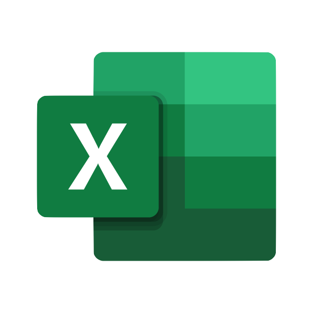

### Hi there 👋

<!--
**Elegrous/Elegrous** is a ✨ _special_ ✨ repository because its `README.md` (this file) appears on your GitHub profile.

Here are some ideas to get you started:

- 🔭 I’m currently working on ...
- 🌱 I’m currently learning ...
- 👯 I’m looking to collaborate on ...
- 🤔 I’m looking for help with ...
- 💬 Ask me about ...
- 📫 How to reach me: ...
- 😄 Pronouns: ...
- ⚡ Fun fact: ...
-->

- I'm a Data Analyst and BI Specialist, based in Dublin, Ireland

- 🔭 I’m currently working on my portfolio in GitHub and on my site https://elegrous.com/
- 🌱 I’m currently learning Data Science, Machine Learning and Statistisc
- 📫 How to reach me: https://www.linkedin.com/in/elegrous/
- ⚡ I want to work at Microsoft 😄

### Languages and Tools:

